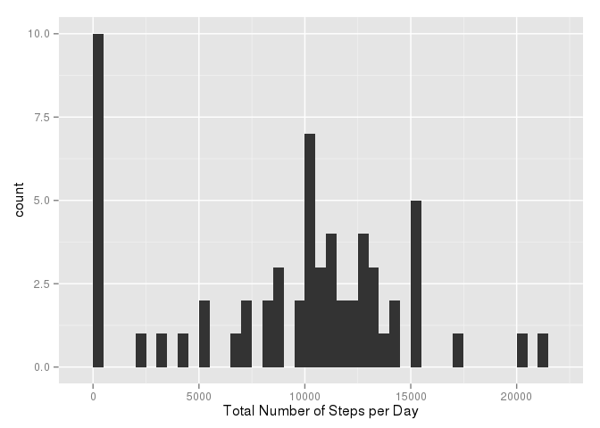
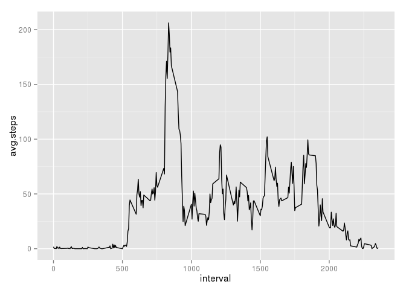
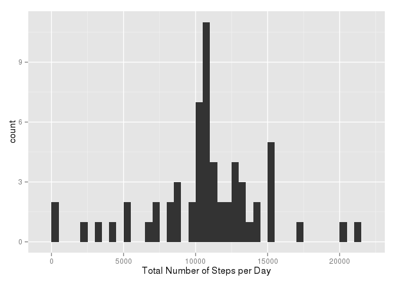
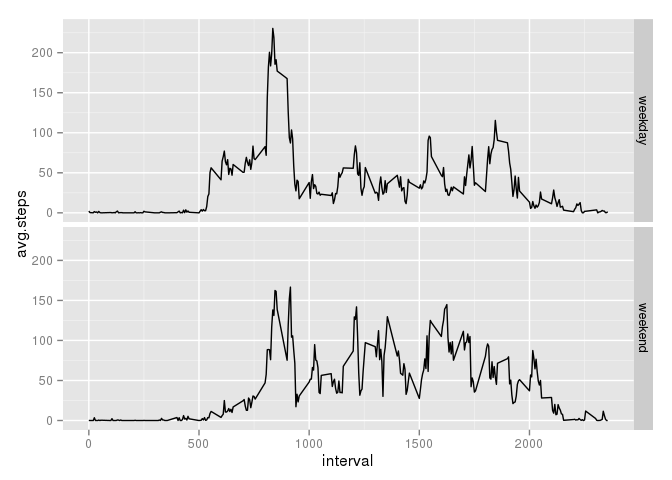

# Reproducible Research: Peer Assessment 1

In this report we analyze the activity data for a particular subject. The data 
is taken from a personal activity monitoring device that registers the number 
of steps taken by the subject every 5 minutes.


## Loading and preprocessing the data

First, we load some libraries that we'll need. Then, the data is loaded from the 
`activity.csv` file and the `date` column is converted from a factor to a Date 
object.


```r
library(ggplot2)
library(plyr)
library(knitr)
opts_chunk$set(fig.path='figures/')

activity <- read.csv("activity.csv")
activity$date <- as.Date(activity$date, "%Y-%m-%d")
```


## What is mean total number of steps taken per day?

To answer this question, we first calculate the total number 
of steps taken per day. Missing values are ignored. We can
then plot a histogram showing the distribution of total steps
among the days.


```r
steps_per_day <- ddply(activity, "date", summarize,
                        steps=sum(steps, na.rm=TRUE))
qplot(x=steps_per_day$steps, xlab="Total Number of Steps per Day", binwidth=500)
```

 

We can then calculate the mean and median of steps across
all dates:


```r
mean(steps_per_day$steps)
```

```
## [1] 9354
```

```r
median(steps_per_day$steps)
```

```
## [1] 10395
```


## What is the average daily activity pattern?

To answer this question we group the number of steps for each
interval and calculate the mean for each group.


```r
daily_pattern <- ddply(activity, "interval", summarize,
                        avg.steps=mean(steps, na.rm=TRUE))
qplot(interval, avg.steps, data=daily_pattern, geom="line")
```

 

We can then identify the interval which has the highest mean:


```r
daily_pattern[daily_pattern$avg.steps == max(daily_pattern$avg.steps), "interval"]
```

```
## [1] 835
```


## Imputing missing values

First, we identify all the rows from the activity data which have
missing values:


```r
missing_activity <- which(is.na(activity$steps))
length(missing_activity)
```

```
## [1] 2304
```

For each missing value in the data set, we replace it with the mean
for that 5-minute interval, calculated in the daily pattern section above:


```r
updated_activity <- activity
replacement_values <- daily_pattern[match(updated_activity[missing_activity, "interval"], daily_pattern$interval), "avg.steps"]
updated_activity[missing_activity, "steps"] <- replacement_values
```

We can now redraw the histogram of the total number of steps per day using
the data set that has no missing values:


```r
steps_per_day <- ddply(updated_activity, "date", summarize,
                        steps=sum(steps, na.rm=TRUE))
qplot(x=steps_per_day$steps, xlab="Total Number of Steps per Day", binwidth=500)
```

 

When we recalculate the mean and median total number of steps per day, we
find that both values have incresed. Interestingly, it seems both values are
the same now.


```r
mean(steps_per_day$steps)
```

```
## [1] 10766
```

```r
median(steps_per_day$steps)
```

```
## [1] 10766
```


## Are there differences in activity patterns between weekdays and weekends?

To answer this question, we create a factor variable that indicates "weekend"
or "weekday" based on the activity date. We then plot a timeseries of the average
steps per interval broken out by weekday or weekend.


```r
updated_activity["day.type"] <- as.factor(
    ifelse(weekdays(updated_activity$date) %in% c("Saturday", "Sunday"), "weekend", "weekday"))
daily_pattern_per_daytype <- ddply(updated_activity, c("day.type", "interval"), summarize,
                                    avg.steps=mean(steps))
qplot(interval, avg.steps, data=daily_pattern_per_daytype, facets=day.type ~ ., geom="line")
```

 

It appears that the plots for both weekday and weekend activity have similar
shapes. The weekday graph reaches a higher max value, but weekend activity seems
to be slightly higher throughout the later parts of the day.
